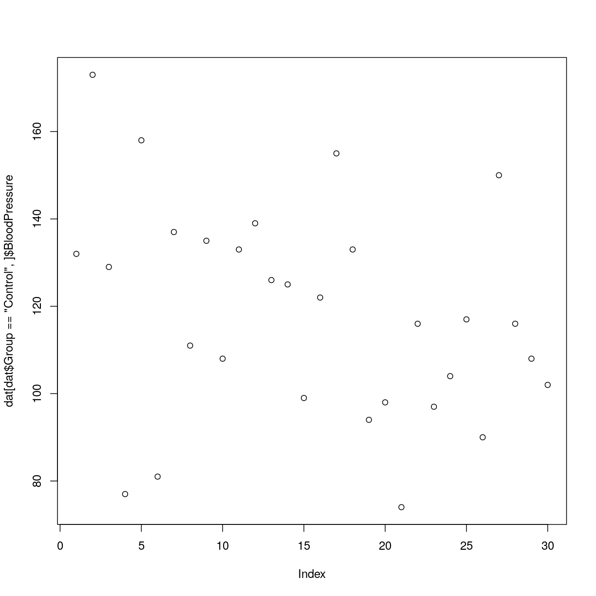
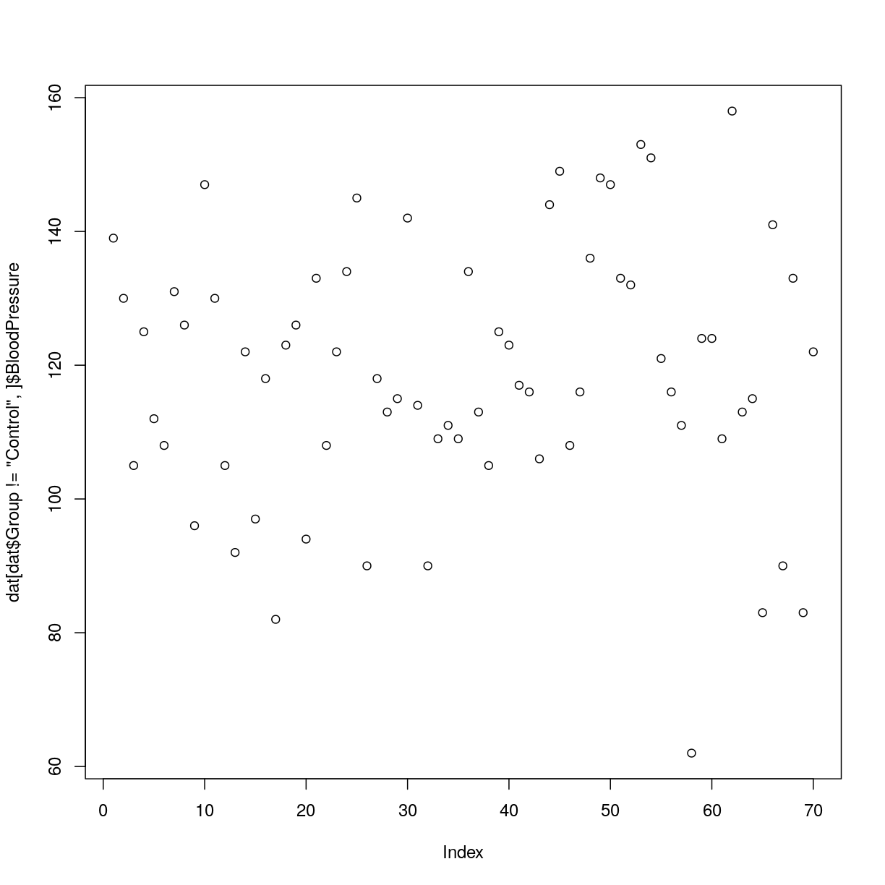

---
# Please do not edit this file directly; it is auto generated.
# Instead, please edit 10-supp-addressing-data.md in _episodes_rmd/
title: "Addressing Data"
teaching: 20
exercises: 0
questions:
- "What are the different methods for accessing parts of a data frame?"
objectives:
- "Understand the three different ways R can address data inside a data frame."
- "Combine different methods for addressing data with the assignment operator to update subsets of data."
keypoints:
- "Data in data frames can be addressed by index (subsetting), by logical vector, or by name (columns only)."
- "Use the `$` operator to address a column by name."
source: Rmd
---

R is a powerful language for data manipulation.
There are three main ways for addressing data inside R objects.

* By index (subsetting)
* By logical vector
* By name

Lets start by loading some sample data:

~~~
dat <- read.csv(file = 'data/sample.csv', header = TRUE, stringsAsFactors = FALSE)
~~~
{: .language-r}

> ## Interpreting Rows as Headers
>
> The first row of this csv file is a list of column names.
> We used the *header = TRUE* argument to `read.csv` so that R can interpret the file correctly.
> We are using the *stringsAsFactors = FALSE* argument to override the default behaviour for R.
> Using factors in R is covered in a separate lesson.
{: .callout}

Lets take a look at this data.

~~~
class(dat)
~~~
{: .language-r}

~~~
[1] "data.frame"
~~~
{: .output}

R has loaded the contents of the .csv file into a variable called `dat` which is a `data frame`.

We can compactly display the internal structure of a data frame using the  structure function `str`.

~~~
str(dat)
~~~
{: .language-r}

~~~
'data.frame':	100 obs. of  9 variables:
 $ ID           : chr  "Sub001" "Sub002" "Sub003" "Sub004" ...
 $ Gender       : chr  "m" "m" "m" "f" ...
 $ Group        : chr  "Control" "Treatment2" "Treatment2" "Treatment1" ...
 $ BloodPressure: int  132 139 130 105 125 112 173 108 131 129 ...
 $ Age          : num  16 17.2 19.5 15.7 19.9 14.3 17.7 19.8 19.4 18.8 ...
 $ Aneurisms_q1 : int  114 148 196 199 188 260 135 216 117 188 ...
 $ Aneurisms_q2 : int  140 209 251 140 120 266 98 238 215 144 ...
 $ Aneurisms_q3 : int  202 248 122 233 222 320 154 279 181 192 ...
 $ Aneurisms_q4 : int  237 248 177 220 228 294 245 251 272 185 ...
~~~
{: .output}

The `str` function tell us that the data has 100 rows and 9 columns. It is also tell us that the data frame is made up of character `chr`, integer `int` and `numeric` vectors.

~~~
head(dat)
~~~
{: .language-r}

~~~
      ID Gender      Group BloodPressure  Age Aneurisms_q1 Aneurisms_q2
1 Sub001      m    Control           132 16.0          114          140
2 Sub002      m Treatment2           139 17.2          148          209
3 Sub003      m Treatment2           130 19.5          196          251
4 Sub004      f Treatment1           105 15.7          199          140
5 Sub005      m Treatment1           125 19.9          188          120
6 Sub006      M Treatment2           112 14.3          260          266
  Aneurisms_q3 Aneurisms_q4
1          202          237
2          248          248
3          122          177
4          233          220
5          222          228
6          320          294
~~~
{: .output}

The data is the results of an (not real) experiment, looking at the number of aneurysms that formed in the eyes of patients who undertook 3 different treatments.

### Addressing by Index

Data can be accessed by index. We have already seen how square brackets `[` can be used to subset data (sometimes also called "slicing"). The generic format is `dat[row_numbers,column_numbers]`.

> ## Selecting Values
>
> What will be returned by `dat[1, 1]`?
> Think about the number of rows and columns you would expect as the result.
>
> > ## Solution
> > 
> > ~~~
> > dat[1, 1]
> > ~~~
> > {: .language-r}
> > 
> > 
> > 
> > ~~~
> > [1] "Sub001"
> > ~~~
> > {: .output}
> {: .solution}
{: .challenge}

If we leave out a dimension R will interpret this as a request for all values in that dimension.

> ## Selecting More Values
>
> What will be returned by `dat[, 2]`?
>
> > ## Solution
> > 
> > ~~~
> > dat[, 2]
> > ~~~
> > {: .language-r}
> > 
> > 
> > 
> > ~~~
> >   [1] "m" "m" "m" "f" "m" "M" "f" "m" "m" "f" "m" "f" "f" "m" "m" "m" "f" "m"
> >  [19] "m" "F" "f" "m" "f" "f" "m" "M" "M" "f" "m" "f" "f" "m" "m" "m" "m" "f"
> >  [37] "f" "m" "M" "m" "f" "m" "m" "m" "f" "f" "M" "M" "m" "m" "m" "f" "f" "f"
> >  [55] "m" "f" "m" "m" "m" "f" "f" "f" "f" "M" "f" "m" "f" "f" "M" "m" "m" "m"
> >  [73] "F" "m" "m" "f" "M" "M" "M" "f" "m" "M" "M" "m" "m" "f" "f" "f" "m" "m"
> >  [91] "f" "m" "F" "f" "m" "m" "F" "m" "M" "M"
> > ~~~
> > {: .output}
> {: .solution}
{: .challenge}

The colon `:` can be used to create a sequence of integers.

~~~
6:9
~~~
{: .language-r}

~~~
[1] 6 7 8 9
~~~
{: .output}

Creates a vector of numbers from 6 to 9.

This can be very useful for addressing data.

> ## Subsetting with Sequences
>
> Use the colon operator to index just the aneurism count data (columns 6 to 9).
>
> > ## Solution
> > 
> > ~~~
> > dat[, 6:9]
> > ~~~
> > {: .language-r}
> > 
> > 
> > 
> > ~~~
> >     Aneurisms_q1 Aneurisms_q2 Aneurisms_q3 Aneurisms_q4
> > 1            114          140          202          237
> > 2            148          209          248          248
> > 3            196          251          122          177
> > 4            199          140          233          220
> > 5            188          120          222          228
> > 6            260          266          320          294
> > 7            135           98          154          245
> > 8            216          238          279          251
> > 9            117          215          181          272
> > 10           188          144          192          185
> > 11           134          155          247          223
> > 12           152          177          323          245
> > 13           112          220          225          195
> > 14           109          150          177          189
> > 15           146          140          239          223
> > 16            97          172          203          207
> > 17           165          157          200          193
> > 18           158          265          243          187
> > 19           178          109          206          182
> > 20           107          188          167          218
> > 21           174          160          203          183
> > 22            97          110          194          133
> > 23           187          239          281          214
> > 24           188          191          256          265
> > 25           114          199          242          195
> > 26           115          160          158          228
> > 27           128          249          294          315
> > 28           112          230          281          126
> > 29           136          109          105          155
> > 30           103          148          219          228
> > 31           132          151          234          162
> > 32           118          154          260          160
> > 33           166          176          253          233
> > 34           152          105          197          299
> > 35           191          148          166          185
> > 36           152          178          158          170
> > 37           161          270          232          284
> > 38           239          184          317          269
> > 39           132          137          193          206
> > 40           168          255          273          274
> > 41           140          184          239          202
> > 42           166           85          179          196
> > 43           141          160          179          239
> > 44           161          168          212          181
> > 45           103          111          254          126
> > 46           231          240          260          310
> > 47           192          141          180          225
> > 48           178          180          169          183
> > 49           167          123          236          224
> > 50           135          150          208          279
> > 51           150          166          153          204
> > 52           192           80          138          222
> > 53           153          153          236          216
> > 54           205          264          269          207
> > 55           117          194          216          211
> > 56           199          119          183          251
> > 57           182          129          226          218
> > 58           180          196          250          294
> > 59           111          111          244          201
> > 60           101           98          178          116
> > 61           166          167          232          241
> > 62           158          171          237          212
> > 63           189          178          177          238
> > 64           189          101          193          172
> > 65           239          189          297          300
> > 66           185          224          151          182
> > 67           224          112          304          288
> > 68           104          139          211          204
> > 69           222          199          280          196
> > 70           107           98          204          138
> > 71           153          255          218          234
> > 72           118          165          220          227
> > 73           102          184          246          222
> > 74           188          125          191          157
> > 75           180          283          204          298
> > 76           178          214          291          240
> > 77           168          184          184          229
> > 78           118          170          249          249
> > 79           169          114          248          233
> > 80           156          138          218          258
> > 81           232          211          219          246
> > 82           188          108          180          136
> > 83           169          168          180          211
> > 84           241          233          292          182
> > 85            65          207          234          235
> > 86           225          185          195          235
> > 87           104          116          173          221
> > 88           179          158          216          244
> > 89           103          140          209          186
> > 90           112          130          175          191
> > 91           226          170          307          244
> > 92           228          221          316          259
> > 93           209          142          199          184
> > 94           153          104          194          214
> > 95           111          118          173          191
> > 96           148          132          200          194
> > 97           141          196          322          273
> > 98           193          112          123          181
> > 99           130          226          286          281
> > 100          126          157          129          160
> > ~~~
> > {: .output}
> {: .solution}
{: .challenge}

Finally we can use the `c()` (combine) function to address non-sequential rows and columns.

~~~
dat[c(1, 5, 7, 9), 1:5]
~~~
{: .language-r}

~~~
      ID Gender      Group BloodPressure  Age
1 Sub001      m    Control           132 16.0
5 Sub005      m Treatment1           125 19.9
7 Sub007      f    Control           173 17.7
9 Sub009      m Treatment2           131 19.4
~~~
{: .output}

Returns the first 5 columns for patients in rows 1,5,7 and 9

> ## Subsetting Non-Sequential Data
>
> Write code to return the age and gender values for the first 5 patients.
>
> > ## Solution
> > 
> > ~~~
> > dat[1:5, c(5, 2)]
> > ~~~
> > {: .language-r}
> > 
> > 
> > 
> > ~~~
> >    Age Gender
> > 1 16.0      m
> > 2 17.2      m
> > 3 19.5      m
> > 4 15.7      f
> > 5 19.9      m
> > ~~~
> > {: .output}
> {: .solution}
{: .challenge}

### Addressing by Name

Columns in an R data frame are named.

~~~
colnames(dat)
~~~
{: .language-r}

~~~
[1] "ID"            "Gender"        "Group"         "BloodPressure"
[5] "Age"           "Aneurisms_q1"  "Aneurisms_q2"  "Aneurisms_q3" 
[9] "Aneurisms_q4" 
~~~
{: .output}

> ## Default Names
>
> If column names are not specified e.g. using `headers = FALSE` in a `read.csv()` function, R assigns default names `V1, V2, ..., Vn`
{: .callout}

We usually use the `$` operator to address a column by name

~~~
dat$Gender
~~~
{: .language-r}

~~~
  [1] "m" "m" "m" "f" "m" "M" "f" "m" "m" "f" "m" "f" "f" "m" "m" "m" "f" "m"
 [19] "m" "F" "f" "m" "f" "f" "m" "M" "M" "f" "m" "f" "f" "m" "m" "m" "m" "f"
 [37] "f" "m" "M" "m" "f" "m" "m" "m" "f" "f" "M" "M" "m" "m" "m" "f" "f" "f"
 [55] "m" "f" "m" "m" "m" "f" "f" "f" "f" "M" "f" "m" "f" "f" "M" "m" "m" "m"
 [73] "F" "m" "m" "f" "M" "M" "M" "f" "m" "M" "M" "m" "m" "f" "f" "f" "m" "m"
 [91] "f" "m" "F" "f" "m" "m" "F" "m" "M" "M"
~~~
{: .output}

When we extract a single column from a data frame using the `$` operator, R will return a vector of that column class and not a data frame.

~~~
class(dat$Gender)
~~~
{: .language-r}

~~~
[1] "character"
~~~
{: .output}

~~~
class(dat$BloodPressure)
~~~
{: .language-r}

~~~
[1] "integer"
~~~
{: .output}

Named addressing can also be used in square brackets.

~~~
head(dat[, c('Age', 'Gender')])
~~~
{: .language-r}

~~~
   Age Gender
1 16.0      m
2 17.2      m
3 19.5      m
4 15.7      f
5 19.9      m
6 14.3      M
~~~
{: .output}

> ## Best Practice
>
> Best practice is to address columns by name. Often, you will create or delete columns and the column position will change.
{: .callout}

 

Rows in an R data frame can also be named, and rows can also be addressed by their names. 
 
By default, row names are indices (i.e. position of each row in the data frame):

~~~
rownames(dat)
~~~
{: .language-r}

~~~
  [1] "1"   "2"   "3"   "4"   "5"   "6"   "7"   "8"   "9"   "10"  "11"  "12" 
 [13] "13"  "14"  "15"  "16"  "17"  "18"  "19"  "20"  "21"  "22"  "23"  "24" 
 [25] "25"  "26"  "27"  "28"  "29"  "30"  "31"  "32"  "33"  "34"  "35"  "36" 
 [37] "37"  "38"  "39"  "40"  "41"  "42"  "43"  "44"  "45"  "46"  "47"  "48" 
 [49] "49"  "50"  "51"  "52"  "53"  "54"  "55"  "56"  "57"  "58"  "59"  "60" 
 [61] "61"  "62"  "63"  "64"  "65"  "66"  "67"  "68"  "69"  "70"  "71"  "72" 
 [73] "73"  "74"  "75"  "76"  "77"  "78"  "79"  "80"  "81"  "82"  "83"  "84" 
 [85] "85"  "86"  "87"  "88"  "89"  "90"  "91"  "92"  "93"  "94"  "95"  "96" 
 [97] "97"  "98"  "99"  "100"
~~~
{: .output}

We can add row names as we read in the file with the `row.names` parameter in `read.csv`. 
In the following example, we choose the first column *ID* to become the vector of row names of the data frame, with `row.names = 1`.

~~~
dat2 <- read.csv(file = 'data/sample.csv', header = TRUE, stringsAsFactors = FALSE, row.names=1)
rownames(dat2)
~~~
{: .language-r}

~~~
  [1] "Sub001" "Sub002" "Sub003" "Sub004" "Sub005" "Sub006" "Sub007" "Sub008"
  [9] "Sub009" "Sub010" "Sub011" "Sub012" "Sub013" "Sub014" "Sub015" "Sub016"
 [17] "Sub017" "Sub018" "Sub019" "Sub020" "Sub021" "Sub022" "Sub023" "Sub024"
 [25] "Sub025" "Sub026" "Sub027" "Sub028" "Sub029" "Sub030" "Sub031" "Sub032"
 [33] "Sub033" "Sub034" "Sub035" "Sub036" "Sub037" "Sub038" "Sub039" "Sub040"
 [41] "Sub041" "Sub042" "Sub043" "Sub044" "Sub045" "Sub046" "Sub047" "Sub048"
 [49] "Sub049" "Sub050" "Sub051" "Sub052" "Sub053" "Sub054" "Sub055" "Sub056"
 [57] "Sub057" "Sub058" "Sub059" "Sub060" "Sub061" "Sub062" "Sub063" "Sub064"
 [65] "Sub065" "Sub066" "Sub067" "Sub068" "Sub069" "Sub070" "Sub071" "Sub072"
 [73] "Sub073" "Sub074" "Sub075" "Sub076" "Sub077" "Sub078" "Sub079" "Sub080"
 [81] "Sub081" "Sub082" "Sub083" "Sub084" "Sub085" "Sub086" "Sub087" "Sub088"
 [89] "Sub089" "Sub090" "Sub091" "Sub092" "Sub093" "Sub094" "Sub095" "Sub096"
 [97] "Sub097" "Sub098" "Sub099" "Sub100"
~~~
{: .output}

We can now extract one or more rows using those row names:

~~~
dat2["Sub072", ]
~~~
{: .language-r}

~~~
       Gender   Group BloodPressure  Age Aneurisms_q1 Aneurisms_q2 Aneurisms_q3
Sub072      m Control           116 17.4          118          165          220
       Aneurisms_q4
Sub072          227
~~~
{: .output}

~~~
dat2[c("Sub009", "Sub072"), ]
~~~
{: .language-r}

~~~
       Gender      Group BloodPressure  Age Aneurisms_q1 Aneurisms_q2
Sub009      m Treatment2           131 19.4          117          215
Sub072      m    Control           116 17.4          118          165
       Aneurisms_q3 Aneurisms_q4
Sub009          181          272
Sub072          220          227
~~~
{: .output}

Note that row names must be **unique**!
 
For example, if we try and read in the data setting the *Group* column as row names, R will throw an error because values in that column are duplicated:

~~~
dat2 <- read.csv(file = 'data/sample.csv', header = TRUE, stringsAsFactors = FALSE, row.names=3)
~~~
{: .language-r}

~~~
Error in read.table(file = file, header = header, sep = sep, quote = quote, : duplicate 'row.names' are not allowed
~~~
{: .error}

### Addressing by Logical Vector

A logical vector contains only the special values `TRUE` and `FALSE`.

~~~
c(TRUE, TRUE, FALSE, FALSE, TRUE)
~~~
{: .language-r}

~~~
[1]  TRUE  TRUE FALSE FALSE  TRUE
~~~
{: .output}

> ## Truth and Its Opposite
>
> Note the values `TRUE` and `FALSE` are all capital letters and are not quoted.
{: .callout}

Logical vectors can be created using `relational operators` e.g. `<, >, ==, !=, %in%`.

~~~
x <- c(1, 2, 3, 11, 12, 13)
x < 10
~~~
{: .language-r}

~~~
[1]  TRUE  TRUE  TRUE FALSE FALSE FALSE
~~~
{: .output}

~~~
x %in% 1:10
~~~
{: .language-r}

~~~
[1]  TRUE  TRUE  TRUE FALSE FALSE FALSE
~~~
{: .output}

We can use logical vectors to select data from a data frame. This is often referred to as *logical indexing*.

~~~
index <- dat$Group == 'Control'
dat[index,]$BloodPressure
~~~
{: .language-r}

~~~
 [1] 132 173 129  77 158  81 137 111 135 108 133 139 126 125  99 122 155 133  94
[20]  98  74 116  97 104 117  90 150 116 108 102
~~~
{: .output}

Often this operation is written as one line of code:

~~~
plot(dat[dat$Group == 'Control', ]$BloodPressure)
~~~
{: .language-r}

> ## Using Logical Indexes
>
> 1. Create a scatterplot showing BloodPressure for subjects not in the control group.
> 2. How many ways are there to index this set of subjects?
> 
> > ## Solution
> > 1. The code for such a plot:
> >     
> >     ~~~
> >     plot(dat[dat$Group != 'Control', ]$BloodPressure)
> >     ~~~
> >     {: .language-r}
> >     
> >     
> > 2. In addition to 
> > `dat$Group != 'Control'`, one could use 
> > `dat$Group %in% c("Treatment1", "Treatment2")`.
> {: .solution}
{: .challenge}

### Combining Addressing and Assignment

The assignment operator `<-` can be combined with addressing.

~~~
x <- c(1, 2, 3, 11, 12, 13)
x[x < 10] <- 0
x
~~~
{: .language-r}

~~~
[1]  0  0  0 11 12 13
~~~
{: .output}

> ## Updating a Subset of Values
>
> In this dataset, values for Gender have been recorded as both uppercase `M, F` and lowercase `m, f`.
> Combine the addressing and assignment operations to convert all values to lowercase.
> 
> > ## Solution
> > ~~~
> > dat[dat$Gender == 'M', ]$Gender <- 'm'
> > dat[dat$Gender == 'F', ]$Gender <- 'f'
> > ~~~
> > {: .language-r}
> {: .solution}
{: .challenge}


