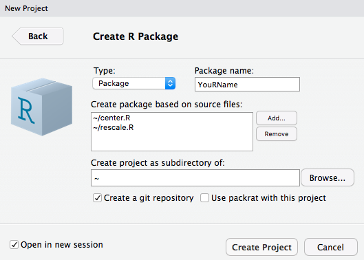
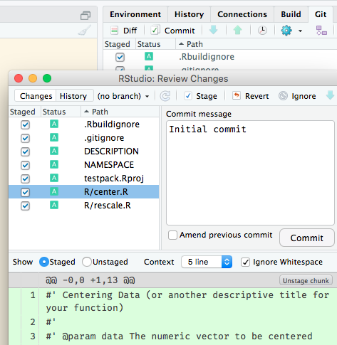

```{r, include = FALSE}
source("../bin/chunk-options.R")
knitr_fig_path("08-making-packages-R-")
```

Why should you make your own R packages?

**Reproducible research!**

An R package is the **basic unit of reusable code**.
If you want to reuse code later or want others to be able to use your code, you should put it in a package.

An R package requires four components:

*   a `DESCRIPTION` file with metadata about the package
*   an `R` directory with the code
*   a `man` directory with documentation (we will create this automatically)
*   a `NAMESPACE` file listing user-level functions in the package (we will also create this automatically)

*There are other optional components. [Read the "R packages" book][r-pkgs-desc] and/or the original ["Writing R Extensions" documentation][WRE]for much more information.*

[r-pkgs-desc]: http://r-pkgs.had.co.nz/description.html
[WRE]: https://cran.r-project.org/doc/manuals/r-release/R-exts.html#Package-structure


### DESCRIPTION file

~~~
Package: PackageName
Title: One Descriptive Sentence (Title Case)
Description: One descriptive paragraph explaining why the package exists and what
  it is useful for. Similar to a paper abstract.
Version: Semantic version number (major.minor.patch)  # see semver.org
Authors@R: person("First", "Last", "first.last@example.com",
  role = c("aut", "cre"),  # see ?person for all possibilities 
  comment = c(ORCID = "0000-…-…-…")))
License: Abbreviation for an open source license
~~~
{: .source}

The package name can only contain letters and numbers and has to start with a letter.

### .R files

Functions don't all have to be in one file or each in separate files.
How you organize them is up to you.
Suggestion: organize in a logical manner so that you know which file holds which functions.

### Making your first R package

Let's turn our `center.R` and `rescale.R` functions into an R package.

```{r center-rescale-to-package}
#' Centering Data
#' 
#' @param data The numeric vector to be centered
#' @param desired The numeric value around which the data should be centered (default = 0)
#'
#' @return A new vector containing the original data centered around the desired value.
#'
#' @examples
#'   center(c(1, 2, 3))  # should return [1] -1  0  1
#'   center(c(1, 2, 3), 1)  # should return [1] 0 1 2

center <- function(data, desired = 0) {
  new_data <- (data - mean(data)) + desired
  return(new_data)
}

#' Rescaling vectors to lie in the range 0 to 1
#'
#' @param v A numeric vector
#'
#' @return The rescaled numeric vector
#'
#' @examples
#'   rescale(c(1, 2, 3))  # should return [1] 0.0 0.5 1.0
#'   rescale(c(1, 2, 3, 4, 5))  # should return [1] 0.00 0.25 0.50 0.75 1.00

rescale <- function(v) {
  L <- min(v)
  H <- max(v)
  result <- (v - L) / (H - L)
  return(result)
}
```

We will use RStudio, and the packages [`usethis`][usethis] and [`roxygen2` from episode 2 "Creating Functions"][02]. These make creating packages in R relatively simple. They can be installed from CRAN like this:

[02]: {{ page.root }}/02-func-R/
[usethis]: https://cran.r-project.org/package=usethis

```{r, eval=FALSE}
install.packages(c("roxygen2", "usethis"))
# several can be combined, but only for installations
library("roxygen2")
library("usethis")
```

In this lesson, we will start building a "personal package". This is meant to
collect any kind of R code that is useful to _you_. As you continue to evolve it
after this lesson, you may move codes that belong to the same publication, topic
or a distinct project, into their own packages. Here we begin to realise the
benefit of [formally documenting the functions already in the episode 2][02]: 
We can publish more quickly, because we didn't leave much unfished clean-up business.

To start working on this personal package, please open RStudio's `File` menu and 
select `New Project… > New Directory… > R Package`. Give it a unique, but useful
name. Your own will work just fine. Bonus points for squeezing in an `R` ;-)
In case you have learned about version control already, it would be a good 
practice to `create a git repository` now and apply what you learned to document
building this package.



This should open a new RStudio window, within which we'll first create an "Initial
commit" in RStudio's `Git` tab. This helps us differentiate between RStudio's  
"skelleton" content of a package, and the "meat" we add later.



RStudio's "skelleton" package can already be built, using the `Build > Install and Restart`
option. Note the `library(...)` line that appears in the console. 
Also, notice there is now a `package:YouRName` environment that is the parent 
environment to the global environment.

```{r, eval=FALSE}
search()
```

This means you can now take
advantage of the console's auto-complete just like for every other package. Type
`cen` and/or `resc`, then `TAB` and insert some example values.

```{r center-rescale-packaged-test}
center(c(1, 2, 3))
rescale(c(1, 2, 3))
```


## Converting function documentation to help pages

Remember that we added some documentation as roxygen2 comments? Let's try and look
it up:

```{r error=TRUE}
?center
help(rescale)
```

> ## Why `No documentation…`? We did write it!
>
> Why do you think the documentation of our package can not be found. Hint: Look
> at the commit diff.
> >
> > ## Solution
> > 
> > We did not yet tell R to actually generate the `man`ual files and folders in
> > our package. This needs to be done with `roxygenise()`
> > 
> {: .solution}
{: .challenge}

After `Install and Restart`-ing again, looking up the documentation should work.

What exactly does `roxygen2` do? It reads lines that begin with `#'` as the function documentation for your package.
Descriptive tags are preceded with the `@` symbol. For example, `@param` has information about the input parameters for the function.

Please take a look at RStudio's `Files` panes now. The `/man` directory should
now contain one LaTeX-like formatted `.Rd` file for each function.

In case you learned about Git already, also view the `.Rd` files in RStudio's
`Git` pane and commit the documentation.

> ## How would you word the commit message?
>
> "Add docu" is a bit moot, because that's obvious from the filenames and contents.
> Which other messages would better explain the "Why?", or that would be more useful
> when browsing the commit history later?
> >
> > ## Solution
> > 
> > - "roxygenise() function comments into help pages" because it includes a hint to the 
> > the command used
> > - "Integrate function docu into R's standard help pages"
> > 
> {: .solution}
{: .challenge}

Also, after `roxygenise()`-ing the function docu, you can tell R to run the examples.
You don't need to copy paste them from the help page.

```{r center-rescale-packaged-test-call, eval=FALSE}
example(center)
example(rescale)
```
