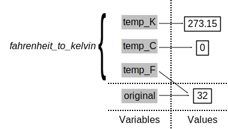

```{r, include = FALSE}
source("../bin/chunk-options.R")
knitr_fig_path("14-supp-call-stack-")
```

### The Call Stack

Let's take a closer look at what happens when we call `fahrenheit_to_celsius(32)`.
To make things clearer,
we'll start by putting the initial value 32 in a variable and store the final result in one as well:

```{r, eval = FALSE}
original <- 32
final <- fahrenheit_to_celsius(original)
```

The diagram below shows what memory looks like after the first line has been executed:


When we call `fahrenheit_to_celsius`, R *doesn't* create the variable `temp` right away.
Instead, it creates something called a [stack frame]({{ page.root }}/reference.html#stack-frame) to keep track of the variables defined by `fahrenheit_to_kelvin`.
Initially, this stack frame only holds the value of `temp`:


When we call `fahrenheit_to_kelvin` inside `fahrenheit_to_celsius`, R creates another stack frame to hold `fahrenheit_to_kelvin`'s variables:


It does this because there are now two variables in play called `temp`: the argument to `fahrenheit_to_celsius`, and the argument to `fahrenheit_to_kelvin`.
Having two variables with the same name in the same part of the program would be ambiguous, so R (and every other modern programming language) creates a new stack frame for each function call to keep that function's variables separate from those defined by other functions.

When the call to `fahrenheit_to_kelvin` returns a value, R throws away `fahrenheit_to_kelvin`'s stack frame and creates a new variable in the stack frame for `fahrenheit_to_celsius` to hold the temperature in Kelvin:


It then calls `kelvin_to_celsius`, which means it creates a stack frame to hold that function's variables:


Once again, R throws away that stack frame when `kelvin_to_celsius` is done
and creates the variable `result` in the stack frame for `fahrenheit_to_celsius`:



Finally, when `fahrenheit_to_celsius` is done, R throws away *its* stack frame and puts its result in a new variable called `final` that lives in the stack frame we started with:


This final stack frame is always there;
it holds the variables we defined outside the functions in our code.
What it *doesn't* hold is the variables that were in the various stack frames.
If we try to get the value of `temp` after our functions have finished running, R tells us that there's no such thing:

```{r, error = TRUE}
temp
```

> ## Where to Learn More
>
> The explanation of the stack frame above was very general and the basic
> concept will help you understand most languages you try to program with.
> However, R has some unique aspects that can be exploited when performing
> more complicated operations. We will not be writing anything that requires
> knowledge of these more advanced concepts. In the future when you are
> comfortable writing functions in R, you can learn more by reading the
> [R Language Manual][man] or this [chapter][] from
> [Advanced R Programming][adv-r] by Hadley Wickham. For context, R uses the
> terminology "environments" instead of frames.
{: .callout}

[man]: https://cran.r-project.org/doc/manuals/r-release/R-lang.html#Environment-objects
[chapter]: http://adv-r.had.co.nz/Environments.html
[adv-r]: http://adv-r.had.co.nz/

Why go to all this trouble? Well, here's a function called `span` that calculates the difference between the minimum and maximum values in an array:

```{r}
span <- function(a) {
  diff <- max(a) - min(a)
  return(diff)
}

dat <- read.csv(file = "data/inflammation-01.csv", header = FALSE)
# span of inflammation data
span(dat)
```

Notice `span` assigns a value to variable called `diff`. We might very well use a variable with the same name (`diff`) to hold the inflammation data:

```{r}
diff <- read.csv(file = "data/inflammation-01.csv", header = FALSE)
# span of inflammation data
span(diff)
```

We don't expect the variable `diff` to have the value `r span(diff)` after this function call, so the name `diff` cannot refer to the same variable defined inside `span` as it does in the main body of our program (which R refers to as the global environment).
And yes, we could probably choose a different name than `diff` for our variable in this case, but we don't want to have to read every line of code of the R functions we call to see what variable names they use, just in case they change the values of our variables.

The big idea here is [encapsulation]({{ page.root }}/reference.html#encapsulation), and it's the key to writing correct, comprehensible programs.
A function's job is to turn several operations into one so that we can think about a single function call instead of a dozen or a hundred statements each time we want to do something.
That only works if functions don't interfere with each other; if they do, we have to pay attention to the details once again, which quickly overloads our short-term memory.

> ## Following the Call Stack
>
> We previously wrote functions called `fence` and `outside`.
> Draw a diagram showing how the call stack changes when we run the following:
>
> ```{r, results="hide", eval = FALSE}
> inner_vec <- "carbon"
> outer_vec <- "+"
> result <- outside(fence(inner_vec, outer_vec))
> ```
{: .challenge}


