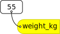
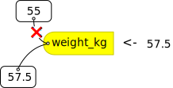
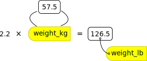
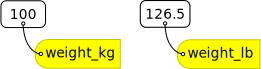
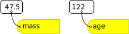

```{r, include = FALSE}
source("../bin/chunk-options.R")
knitr_fig_path("01-starting-with-data-")
```

We are studying inflammation in patients who have been given a new treatment for arthritis,
and need to analyze the first dozen data sets.
The data sets are stored in [comma-separated values]({{ page.root }}/reference.html#comma-separated-values-csv) (CSV) format. Each row holds the observations for just one patient. Each column holds the inflammation measured in a day, so we have a set of values in successive days.
The first few rows of our first file look like this:

```{r echo = FALSE}
tmp <- read.csv("data/inflammation-01.csv", header = FALSE, nrows = 5)
write.table(tmp, quote = FALSE, sep = ",", row.names = FALSE, col.names = FALSE)
rm(tmp)
```

We want to:

* Load data into memory,
* Calculate the average value of inflammation per day across all patients, and
* Plot the results.

To do all that, we'll have to learn a little bit about programming.

### Loading Data

Let's import the file called `inflammation-01.csv` into our R environment. To import the file, first we need to tell our computer where the file is. We do that by choosing a working directory, that is, a local directory on our computer containing the files we need. This is very important in R. If we forget this step we'll get an error message saying that the file does not exist. We can set the working directory using the function `setwd`. For this example, we change the path to our new directory at the desktop:

```{r, eval = FALSE}
setwd("~/Desktop/r-novice-inflammation/")
```

Just like in the Unix Shell, we type the command and then press <kbd>Return</kbd> (or <kbd>Enter</kbd>).
Alternatively you can change the working directory using the RStudio GUI using the menu option `Session` -> `Set Working Directory` -> `Choose Directory...`

The data file is located in the directory `data` inside the working directory. Now we can load the data into R using `read.csv`:

```{r, results = "hide"}
read.csv(file = "data/inflammation-01.csv", header = FALSE)
```

The expression `read.csv(...)` is a [function call]({{ page.root }}/reference.html#function-call) that asks R to run the function `read.csv`.

`read.csv` has two [arguments]({{ page.root }}/reference.html#argument): the name of the file we want to read, and whether the first line of the file contains names for the columns of data.
The filename needs to be a character string (or [string]({{ page.root }}/reference.html#string) for short), so we put it in quotes. Assigning the second argument, `header`, to be `FALSE` indicates that the data file does not have column headers. We'll talk more about the value `FALSE`, and its converse `TRUE`, in lesson 04. In case of our `inflammation-01.csv` example, R auto-generates column names in the sequence `V1` (for "variable 1"), `V2`, and so on, until `V40`.

> ## Other Options for Reading CSV Files
>
> `read.csv` actually has many more arguments that you may find useful when
> importing your own data in the future. You can learn more about these
> options in this supplementary [lesson]({{ page.root }}/11-supp-read-write-csv/).
{: .callout}

> ## Loading Data with Headers
>
> What happens if you forget to put `header = FALSE`? The default value is
> `header = TRUE`, which you can check with `?read.csv` or `help(read.csv)`.
> What do you expect will happen if you leave the default value?
> Before you run any code, think about what will happen to the first few rows
> of your data frame, and its overall size. Then run the following code and
> see if your expectations agree:
>
> ~~~
> read.csv(file = "data/inflammation-01.csv")
> ~~~
> {: .language-r}
>
> > ## Solution
> > 
> > R will construct column headers from values in your first row of data, 
> > resulting in `X0 X0.1 X1 X3 X1.1 X2 ...`. 
> > 
> > Note that the `X` is prepended just a number would not be a valid variable
> > name. Because that's what column headers are, the same rules apply. 
> > Appending `.1`, `.2` etc. is necessary to avoid duplicate column headers.
> {: .solution}
{: .challenge}

> ## Reading Different Decimal Point Formats
>
> Depending on the country you live in, your standard can use the dot or the comma as decimal mark.
> Also, different devices or software can generate data with different decimal points.
> Take a look at `?read.csv` and write the code to load a file called `commadec.txt` that has numeric values with commas as decimal mark, separated by semicolons.
>
> > ## Solution
> > 
> > ~~~
> > read.csv(file = "data/commadec.txt", sep = ";", dec = ",")
> > ~~~
> > {: .language-r}
> > 
> > or the built-in shortcut:
> > 
> > ~~~
> > read.csv2(file = "data/commadec.txt")
> > ~~~
> > {: .language-r}
> {: .solution}
{: .challenge}

A function will perform its given action on whatever value is passed to the argument(s).
For example, in this case if we provided the name of a different file to the argument `file`, `read.csv` would read that instead.
We'll learn more about the details of functions and their arguments in the next lesson.

Since we didn't tell it to do anything else with the function's output, the console will display the full contents of the file `inflammation-01.csv`.
Try it out.

`read.csv` reads the file, but we can't use the data unless we assign it to a variable.
We can think of a variable as a container with a name, such as `x`, `current_temperature`, or `subject_id` that contains one or more values.
We can create a new variable and assign a value to it using `<-`.

```{r}
weight_kg <- 55
```

Once a variable is created, we can use the variable name to refer to the value it was assigned. The variable name now acts as a tag. Whenever R reads that tag (`weight_kg`), it substitutes the value (`55`).



To see the value of a variable, we can print it by typing the name of the variable and hitting <kbd>Return</kbd> (or <kbd>Enter</kbd>).
In general, R will print to the console any object returned by a function or operation *unless* we assign it to a variable.

```{r}
weight_kg
```
We can treat our variable like a regular number, and do arithmetic with it:

```{r}
# weight in pounds:
2.2 * weight_kg
```


> ## Commenting
>
> We can add comments to our code using the `#` character. It is useful to
> document our code in this way so that others (and us the next time we
> read it) have an easier time following what the code is doing.
{: .callout}

We can also change a variable's value by assigning it a new value:

```{r}
weight_kg <- 57.5
# weight in kilograms is now
weight_kg
```
> ## Variable Naming Conventions
>
> Historically, R programmers have used a variety of conventions for naming variables. The `.` character
> in R can be a valid part of a variable name; thus the above assignment could have easily been `weight.kg <- 57.5`.
> This is often confusing to R newcomers who have programmed in languages where `.` has a more significant meaning.
> Today, most R programmers 1) start variable names with lower case letters, 2) separate words in variable names with
> underscores, and 3) use only lowercase letters, underscores, and numbers in variable names. The book *R Packages* includes
> a [chapter](http://r-pkgs.had.co.nz/style.html) on this and other style considerations.
{: .callout}



Assigning a new value to a variable breaks the connection with the old value; R forgets that number and applies the variable name to the new value. 

When you assign a value to a variable, R only stores the value, not the calculation you used to create it. This is an important point if you're used to the way a spreadsheet program automatically updates linked cells. Let's look at an example.

First, we'll convert `weight_kg` into pounds, and store the new value in the variable `weight_lb`:

```{r}
weight_lb <- 2.2 * weight_kg
# weight in kg...
weight_kg
# ...and in pounds
weight_lb
```

In words, we're asking R to look up the value we tagged `weight_kg`,
multiply it by 2.2, and tag the result with the name `weight_lb`:



If we now change the value of `weight_kg`:

```{r}
weight_kg <- 100.0
# weight in kg now...
weight_kg
# ...and weight in pounds still
weight_lb
```



Since `weight_lb` doesn't "remember" where its value came from, it isn't automatically updated when `weight_kg` changes.
This is different from the way spreadsheets work.

> ## Printing with Parentheses
>
> An alternative way to print the value of a variable is to use
> `(` parentheses `)` around the assignment statement.
> As an example: `(total_weight <- weight_kg + weight_lb)` adds the values of `weight_kg` and `weight_lb`,
> assigns the result to the `total_weight`,
> and finally prints the assigned value of the variable `total_weight`.
{: .callout}

Now that we know how to assign things to variables, let's re-run `read.csv` and save its result into a variable called 'dat':

```{r}
dat <- read.csv(file = "data/inflammation-01.csv", header = FALSE)
```

This statement doesn't produce any output because the assignment doesn't display anything.
If we want to check if our data has been loaded, we can print the variable's value by typing the name of the variable `dat`. However, for large data sets it is convenient to use the function `head` to display only the first few rows of data.


```{r}
head(dat)
```

> ## Assigning Values to Variables
>
> Draw diagrams showing what variables refer to what values after each statement in the following program:
>
> ~~~
> mass <- 47.5
> age <- 122
> mass <- mass * 2.0
> age <- age - 20
> ~~~
> {: .language-r}
>
> > ## Solution
> >
> > ~~~
> > mass <- 47.5
> > age <- 122
> > ~~~
> > {: .language-r}
> > 
> > 
> >
> > ~~~
> > mass <- mass * 2.0
> > age <- age - 20
> > ~~~
> > {: .language-r}
> > 
> > 
> > 
> {: .solution}
{: .challenge}

### Manipulating Data

Now that our data are loaded into R, we can start doing things with them.
First, let's ask what type of thing `dat` is:

```{r}
class(dat)
```

The output tells us that it's a data frame. Think of this structure as a spreadsheet in MS Excel that many of us are familiar with.
Data frames are very useful for storing data and you will use them frequently when programming in R.
A typical data frame of experimental data contains individual observations in rows and variables in columns.

We can see the shape, or [dimensions]({{ page.root }}/reference.html#dimensions-of-an-array), of the data frame with the function `dim`:

```{r}
dim(dat)
```

This tells us that our data frame, `dat`, has `r nrow(dat)` rows and `r ncol(dat)` columns.

If we want to get a single value from the data frame, we can provide an [index]({{ page.root }}/reference.html#index) in square brackets. The first number specifies the row and the second the column:

```{r selecting data frame elements}
# first value in dat, row 1, column 1
dat[1, 1]
# middle value in dat, row 30, column 20
dat[30, 20]
```

The first value in a data frame index is the row, the second value is the column.
If we want to select more than one row or column, we can use the function `c`, which stands for **c**ombine.
For example, to pick columns 10 and 20 from rows 1, 3, and 5, we can do this:

```{r selecting with c}
dat[c(1, 3, 5), c(10, 20)]
```

We frequently want to select contiguous rows or columns, such as the first ten rows, or columns 3 through 7. You can use `c` for this, but it's more convenient to use the `:` operator. This special function generates sequences of numbers:

```{r sequences}
1:5
3:12
```

For example, we can select the first ten columns of values for the first four rows like this:

```{r}
dat[1:4, 1:10]
```

or the first ten columns of rows 5 to 10 like this:

```{r}
dat[5:10, 1:10]
```

If you want to select all rows or all columns, leave that index value empty. 

```{r}
# All columns from row 5
dat[5, ]
# All rows from column 16-18
dat[, 16:18]
```

If you leave both index values empty (i.e., `dat[,]`), you get the entire data frame. 

> ## Addressing Columns by Name
>
> Columns can also be addressed by name, with either the `$` operator (ie. `dat$V16`) or square brackets (ie. `dat[, 'V16']`).
> You can learn more about subsetting by column name in this supplementary [lesson]({{ page.root }}/10-supp-addressing-data/).
{: .callout}

Now let's perform some common mathematical operations to learn more about our inflammation data.
When analyzing data we often want to look at partial statistics, such as the maximum value per patient or the average value per day.
One way to do this is to select the data we want to create a new temporary data frame, and then perform the calculation on this subset:

```{r}
# first row, all of the columns
patient_1 <- dat[1, ]
# max inflammation for patient 1
max(patient_1)
```
<!-- 
    OUCH!! The following may be true, but it will vary by R version, not by
    installation! There shouldn't be an issue with a data frame where all
    columns are numeric without missing values. Under those circumstances,
    coercion should do what you expect. You'll get problems with mixed
    types (factors, character etc), or with missing values. If this is
    actually a problem, we need to change the example - we should be able
    to come up with an example that doesn't require this ugliness in the
    very first lesson. 
    
    Also, columns always work as expected because by definition a column
    contains a vector of values of the same type. Rows include values from
    different columns, which of course can be different types. This doesn't
    need to be confusing, and if we're careful in our presentation here we
    can avoid this until the students know enough to cope rationally.
-->

<!--
> ## Forcing Conversion
>
> The code above may give you an error in some R installations,
> since R does not automatically convert a row from a `data.frame` to a vector.
> (Confusingly, subsetted columns are automatically converted.)
> If this happens, you can use the `as.numeric` command to convert the row of data to a numeric vector:
>
> `patient_1 <- as.numeric(dat[1, ])`
>
> `max(patient_1)`
>
> You can also check the `class` of each object:
>
> `class(dat[1, ])`
>
> `class(as.numeric(dat[1, ]))`
{: .callout}
-->

We don't actually need to store the row in a variable of its own.
Instead, we can combine the selection and the function call:

```{r}
# max inflammation for patient 2
max(dat[2, ])
```

R also has functions for other common calculations, e.g. finding the minimum, mean, median, and standard deviation of the data:

```{r}
# minimum inflammation on day 7
min(dat[, 7])
# mean inflammation on day 7
mean(dat[, 7])
# median inflammation on day 7
median(dat[, 7])
# standard deviation of inflammation on day 7
sd(dat[, 7])
```

> ## Forcing Conversion
>
> Note that R may return an error when you attempt to perform similar calculations on 
> subsetted *rows* of data frames. This is because some functions in R automatically convert 
> the object type to a numeric vector, while others do not (e.g. `max(dat[1, ])` works as 
> expected, while `mean(dat[1, ])` returns `NA` and a warning). You get the
> expected output by including an
> explicit call to `as.numeric()`, e.g. `mean(as.numeric(dat[1, ]))`. By contrast, 
> calculations on subsetted *columns* always work as expected, since columns of data frames 
> are already defined as vectors.
{: .callout}

R also has a function that summaries the previous common calculations:

```{r}
# Summarize function
summary(dat[, 1:4])
```

For every column in the data frame, the function "summary" calculates: the minimun value, the first quartile, the median, the mean, the third quartile and the max value, giving helpful details about the sample distribution.

What if we need the maximum inflammation for all patients, or the average for each day?
As the diagram below shows, we want to perform the operation across a margin of the data frame:


To support this, we can use the `apply` function.

> ## Getting Help
>
> To learn about a function in R, e.g. `apply`, we can read its help
> documention by running `help(apply)` or `?apply`.
{: .callout}

`apply` allows us to repeat a function on all of the rows (`MARGIN = 1`) or columns (`MARGIN = 2`) of a data frame.

Thus, to obtain the average inflammation of each patient we will need to calculate the mean of all of the rows (`MARGIN = 1`) of the data frame.

```{r}
avg_patient_inflammation <- apply(dat, 1, mean)
```

And to obtain the average inflammation of each day we will need to calculate the mean of all of the columns (`MARGIN = 2`) of the data frame.

```{r}
avg_day_inflammation <- apply(dat, 2, mean)
```

Since the second argument to `apply` is `MARGIN`, the above command is equivalent to `apply(dat, MARGIN = 2, mean)`.
We'll learn why this is so in the next lesson.

> ## Efficient Alternatives
>
> Some common operations have more efficient alternatives. For example, you
> can calculate the row-wise or column-wise means with `rowMeans` and
> `colMeans`, respectively.
{: .callout}

> ## Subsetting Data
>
> We can take subsets of character vectors as well:
>
> ```{r}
> animal <- c("m", "o", "n", "k", "e", "y")
> # first three characters
> animal[1:3]
> # last three characters
> animal[4:6]
> ```
>
> 1.  If the first four characters are selected using the subset `animal[1:4]`, how can we obtain the first four characters in reverse order?
>
> 1.  What is `animal[-1]`?
>    What is `animal[-4]`?
>    Given those answers,
>    explain what `animal[-1:-4]` does.
>
> 1.  Use a subset of `animal` to create a new character vector that spells the word "eon", i.e. `c("e", "o", "n")`.
> > ## Solutions
> > 
> > 1. `animal[4:1]`
> > 
> > 1. `"o" "n" "k" "e" "y"` and `"m" "o" "n" "e" "y"`, which means that a
> >    single `-` removes the element at the given index position.
> >    `animal[-1:-4]` remove the subset, returning `"e" "y"`, which is
> >    equivalent to `animal[5:6]`.
> > 
> > 1. `animal[c(5,2,3)]` combines indexing with the `c`ombine function.
> > 
> {: .solution}
{: .challenge}

> ## Subsetting More Data
>
> Suppose you want to determine the maximum inflammation for patient 5 across days three to seven.
> To do this you would extract the relevant subset from the data frame and calculate the maximum value.
> Which of the following lines of R code gives the correct answer?
>
> 1. `max(dat[5, ])`
> 2. `max(dat[3:7, 5])`
> 3. `max(dat[5, 3:7])`
> 4. `max(dat[5, 3, 7])`
>
> > ## Solution
> >  
> > Answer: 3
> >
> > Explanation: You want to extract the part of the dataframe representing data for patient 5 from days three to seven. In this dataframe, patient data is organised in rows and the days are represented by the columns. Subscripting in R follows the `[i, j]` principle, where `i = rows` and `j = columns`. Thus, answer 3 is correct since the patient is represented by the value for i (5) and the days are represented by the values in j, which is a subset spanning day 3 to 7.
> > 
> {: .solution}
{: .challenge}

> ## Subsetting and Re-Assignment
>
> Using the inflammation data frame `dat` from above:
> Let's pretend there was something wrong with the instrument on the first five days for every second patient (#2, 4, 6, etc.), which resulted in the measurements being twice as large as they should be.
>
> 1. Write a vector containing each affected patient (hint: `?seq`)
> 2. Create a new data frame in which you halve the first five days' values in only those patients
> 3. Print out the corrected data frame to check that your code has fixed the problem
>
> > ## Solution
> > ~~~
> > whichPatients <- seq(2, 60, 2) # i.e., which rows
> > whichDays <- seq(1, 5)         # i.e., which columns
> > dat2 <- dat
> > # check the size of your subset: returns `30 5`, that is 30 [rows=patients] by 5 [columns=days]
> > dim(dat2[whichPatients, whichDays])
> > dat2[whichPatients, whichDays] <- dat2[whichPatients, whichDays] / 2
> > dat2
> > ~~~
> > {: .language-r}
> {: .solution}
{: .challenge}


> ## Using the Apply Function on Patient Data
>
> Challenge: the apply function can be used to summarize datasets and subsets
> of data across rows and columns using the MARGIN argument.
> Suppose you want to calculate the mean inflammation for specific days and patients
> in the patient dataset (i.e. 60 patients across 40 days).
>
> Please use a combination of the apply function and indexing to:
>
> 1. calculate the mean inflammation for patients 1 to 5 over the whole 40 days
> 1. calculate the mean inflammation for days 1 to 10 (across all patients).
> 1. calculate the mean inflammation for every second day (across all patients).
>
> Think about the number of rows and columns you would expect as the result before each
> apply call and check your intuition by applying the mean function.
>
> > ## Solution
> > ~~~
> > # 1.
> > apply(dat[1:5, ], 1, mean)
> > # 2.
> > apply(dat[, 1:10], 2, mean)
> > # 3.
> > apply(dat[, seq(1, 40, by = 2)], 2, mean)
> > ~~~
> > {: .language-r}
> {: .solution}
{: .challenge}


### Plotting

The mathematician Richard Hamming once said, "The purpose of computing is insight, not numbers," and the best way to develop insight is often to visualize data.
Visualization deserves an entire lecture (or course) of its own, but we can explore a few of R's plotting features.

Let's take a look at the average inflammation over time.
Recall that we already calculated these values above using `apply(dat, 2, mean)` and saved them in the variable `avg_day_inflammation`.
Plotting the values is done with the function `plot`.

```{r plot-avg-inflammation}
plot(avg_day_inflammation)
```

Above, we gave the function `plot` a vector of numbers corresponding to the average inflammation per day across all patients.
`plot` created a scatter plot where the y-axis is the average inflammation level and the x-axis is the order, or index, of the values in the vector, which in this case correspond to the 40 days of treatment.
The result is roughly a linear rise and fall, which is suspicious: based on other studies, we expect a sharper rise and slower fall.
Let's have a look at two other statistics: the maximum and minimum inflammation per day.

```{r plot-max-inflammation}
max_day_inflammation <- apply(dat, 2, max)
plot(max_day_inflammation)
```

```{r plot-min-inflammation}
min_day_inflammation <- apply(dat, 2, min)
plot(min_day_inflammation)
```

The maximum value rises and falls perfectly smoothly, while the minimum seems to be a step function. Neither result seems particularly likely, so either there's a mistake in our calculations or something is wrong with our data.

> ## Plotting Data
>
> Create a plot showing the standard deviation of the inflammation data for each day across all patients.
>
> > ## Solution
> > 
> > ~~~
> > sd_day_inflammation <- apply(dat, 2, sd)
> > plot(sd_day_inflammation)
> > ~~~
> > {: .language-r}
> {: .solution}
{: .challenge}


