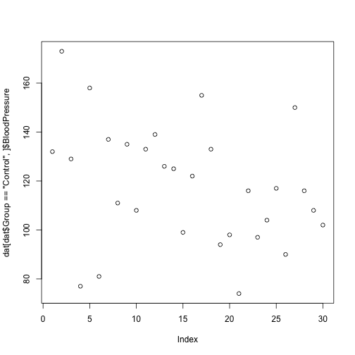

R is a powerful language for data manipulation.
There are three main ways for addressing data inside R objects.

* By index (slicing)
* By logical vector
* By name (columns only)

Lets start by loading some sample data:

~~~
dat <- read.csv(file = 'data/sample.csv', header = TRUE, stringsAsFactors = FALSE)
~~~
{: .r}

> ## Interpreting Rows as Headers
>
> The first row of this csv file is a list of column names.
> We used the *header=TRUE* argument to `read.csv` so that R can interpret the file correctly.
> We are using the *stringsAsFactors=FALSE* argument to override the default behaviour for R.
> Using factors in R is covered in a separate lesson.
{: .callout}

Lets take a look at this data.

~~~
class(dat)
~~~
{: .r}

~~~
[1] "data.frame"
~~~
{: .output}

R has loaded the contents of the .csv file into a variable called `dat` which is a `data frame`.

~~~
dim(dat)
~~~
{: .r}

~~~
[1] 100   9
~~~
{: .output}

The data has 100 rows and 9 columns.

~~~
head(dat)
~~~
{: .r}

~~~
      ID Gender      Group BloodPressure  Age Aneurisms_q1 Aneurisms_q2
1 Sub001      m    Control           132 16.0          114          140
2 Sub002      m Treatment2           139 17.2          148          209
3 Sub003      m Treatment2           130 19.5          196          251
4 Sub004      f Treatment1           105 15.7          199          140
5 Sub005      m Treatment1           125 19.9          188          120
6 Sub006      M Treatment2           112 14.3          260          266
  Aneurisms_q3 Aneurisms_q4
1          202          237
2          248          248
3          122          177
4          233          220
5          222          228
6          320          294
~~~
{: .output}

The data is the results of an (not real) experiment, looking at the number of aneurysms that formed in the eyes of patients who undertook 3 different treatments.

### Addressing by Index

Data can be accessed by index. We have already seen how square brackets `[` can be used to subset (slice) data. The generic format is `dat[row_numbers,column_numbers]`.

> ## Selecting Values
>
> What will be returned by `dat[1,1]`?
{: .challenge}

~~~
dat[1,1]
~~~
{: .r}

~~~
[1] "Sub001"
~~~
{: .output}

If we leave out a dimension R will interpret this as a request for all values in that dimension.

> ## Selecting More Values
>
> What will be returned by `dat[,2]`?
{: .challenge}

The colon `:` can be used to create a sequence of integers.

~~~
6:9
~~~
{: .r}

~~~
[1] 6 7 8 9
~~~
{: .output}

Creates a vector of numbers from 6 to 9.

This can be very useful for addressing data.

> ## Subsetting with Sequences
>
> Use the colon operator to index just the aneurism count data (columns 6 to 9).
{: .challenge}

Finally we can use the `c()` (combine) function to address non-sequential rows and columns.

~~~
dat[c(1,5,7,9), 1:5]
~~~
{: .r}

~~~
      ID Gender      Group BloodPressure  Age
1 Sub001      m    Control           132 16.0
5 Sub005      m Treatment1           125 19.9
7 Sub007      f    Control           173 17.7
9 Sub009      m Treatment2           131 19.4
~~~
{: .output}

Returns the first 5 columns for patients in rows 1,5,7 & 9

> ## Subsetting Non-Sequential Data
>
> Return the age and gender values for the first 5 patients.
{: .challenge}

### Addressing by Name

Columns in an R data frame are named.

~~~
names(dat)
~~~
{: .r}

~~~
[1] "ID"            "Gender"        "Group"         "BloodPressure"
[5] "Age"           "Aneurisms_q1"  "Aneurisms_q2"  "Aneurisms_q3" 
[9] "Aneurisms_q4" 
~~~
{: .output}

> ## Default Names
>
> If names are not specified e.g. using `headers=FALSE` in a `read.csv()` function, R assigns default names `V1,V2,...,Vn`
{: .callout}

We usually use the `$` operator to address a column by name

~~~
dat$Gender
~~~
{: .r}

~~~
  [1] "m" "m" "m" "f" "m" "M" "f" "m" "m" "f" "m" "f" "f" "m" "m" "m" "f"
 [18] "m" "m" "F" "f" "m" "f" "f" "m" "M" "M" "f" "m" "f" "f" "m" "m" "m"
 [35] "m" "f" "f" "m" "M" "m" "f" "m" "m" "m" "f" "f" "M" "M" "m" "m" "m"
 [52] "f" "f" "f" "m" "f" "m" "m" "m" "f" "f" "f" "f" "M" "f" "m" "f" "f"
 [69] "M" "m" "m" "m" "F" "m" "m" "f" "M" "M" "M" "f" "m" "M" "M" "m" "m"
 [86] "f" "f" "f" "m" "m" "f" "m" "F" "f" "m" "m" "F" "m" "M" "M"
~~~
{: .output}

Named addressing can also be used in square brackets.

~~~
head(dat[,c('Age', 'Gender')])
~~~
{: .r}

~~~
   Age Gender
1 16.0      m
2 17.2      m
3 19.5      m
4 15.7      f
5 19.9      m
6 14.3      M
~~~
{: .output}

> ## Best Practice
>
> Best practice is to address columns by name, often you will create or delete columns and the column position will change.
{: .callout}

### Logical Indexing

A logical vector contains only the special values `TRUE` & `FALSE`.

~~~
c(TRUE, TRUE, FALSE, FALSE, TRUE)
~~~
{: .r}

~~~
[1]  TRUE  TRUE FALSE FALSE  TRUE
~~~
{: .output}
> ## Truth and Its Opposite
>
> Note the values `TRUE` and `FALSE` are all capital letters and are not quoted.
{: .callout}

Logical vectors can be created using `relational operators` e.g. `<, >, ==, !=, %in%`.

~~~
x <- c(1, 2, 3, 11, 12, 13)
x < 10
~~~
{: .r}

~~~
[1]  TRUE  TRUE  TRUE FALSE FALSE FALSE
~~~
{: .output}

~~~
x %in% 1:10
~~~
{: .r}

~~~
[1]  TRUE  TRUE  TRUE FALSE FALSE FALSE
~~~
{: .output}

We can use logical vectors to select data from a data frame.

~~~
index <- dat$Group == 'Control'
dat[index,]$BloodPressure
~~~
{: .r}

~~~
 [1] 132 173 129  77 158  81 137 111 135 108 133 139 126 125  99 122 155
[18] 133  94  98  74 116  97 104 117  90 150 116 108 102
~~~
{: .output}

Often this operation is written as one line of code:

~~~
plot(dat[dat$Group == 'Control',]$BloodPressure)
~~~
{: .r}

> ## Using Logical Indexes
>
> 1. Create a scatterplot showing BloodPressure for subjects not in the control group.
> 2. How many ways are there to index this set of subjects?
{: .challenge}

### Combining Indexing and Assignment

The assignment operator `<-` can be combined with indexing.

~~~
x <- c(1, 2, 3, 11, 12, 13)
x[x < 10] <- 0
x
~~~
{: .r}

~~~
[1]  0  0  0 11 12 13
~~~
{: .output}

> ## Updating a Subset of Values
>
> In this dataset, values for Gender have been recorded as both uppercase `M, F` and lowercase `m,f`.
> Combine the indexing and assignment operations to convert all values to lowercase.
{: .challenge}
