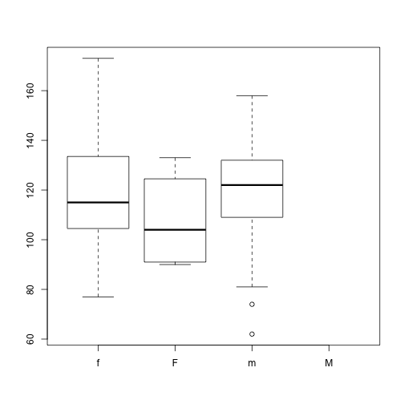

Factors are used to represent categorical data. Factors can be ordered or
unordered and are an important class for statistical analysis and for plotting.

Factors are stored as integers, and have labels associated with these unique
integers. While factors look (and often behave) like character vectors, they are
actually integers under the hood, and you need to be careful when treating them
like strings.

Once created, factors can only contain a pre-defined set values, known as
*levels*. By default, R always sorts *levels* in alphabetical order. For
instance, if you have a factor with 2 levels:

> ## The `factor()` Command
>
> The `factor()` command is used to create and modify factors in R:
>
> 
> ~~~
> sex <- factor(c("male", "female", "female", "male"))
> ~~~
> {: .r}
{: .callout}

R will assign `1` to the level `"female"` and `2` to the level `"male"` (because
`f` comes before `m`, even though the first element in this vector is
`"male"`). You can check this by using the function `levels()`, and check the
number of levels using `nlevels()`:

~~~
levels(sex)
~~~
{: .r}

~~~
[1] "female" "male"  
~~~
{: .output}

~~~
nlevels(sex)
~~~
{: .r}

~~~
[1] 2
~~~
{: .output}

Sometimes, the order of the factors does not matter, other times you might want
to specify the order because it is meaningful (e.g., "low", "medium", "high") or
it is required by particular type of analysis. Additionally, specifying the
order of the levels allows us to compare levels:

~~~
food <- factor(c("low", "high", "medium", "high", "low", "medium", "high"))
levels(food)
~~~
{: .r}

~~~
[1] "high"   "low"    "medium"
~~~
{: .output}

~~~
food <- factor(food, levels = c("low", "medium", "high"))
levels(food)
~~~
{: .r}

~~~
[1] "low"    "medium" "high"  
~~~
{: .output}

~~~
min(food) ## doesn't work
~~~
{: .r}

~~~
Error in Summary.factor(structure(c(1L, 3L, 2L, 3L, 1L, 2L, 3L), .Label = c("low", : 'min' not meaningful for factors
~~~
{: .error}

~~~
food <- factor(food, levels = c("low", "medium", "high"), ordered=TRUE)
levels(food)
~~~
{: .r}

~~~
[1] "low"    "medium" "high"  
~~~
{: .output}

~~~
min(food) ## works!
~~~
{: .r}

~~~
[1] low
Levels: low < medium < high
~~~
{: .output}

In R's memory, these factors are represented by numbers (1, 2, 3). They are
better than using simple integer labels because factors are self describing:
`"low"`, `"medium"`, and `"high"`" is more descriptive than `1`, `2`, `3`. Which
is low?  You wouldn't be able to tell with just integer data. Factors have this
information built in. It is particularly helpful when there are many levels
(like the subjects in our example data set).

> ## Representing Data in R
>
> You have a vector representing levels of exercise undertaken by 5 subjects
>
> **"l","n","n","i","l"** ; n=none, l=light, i=intense
>
> What is the best way to represent this in R?
>
> a) exercise <- c("l", "n", "n", "i", "l")
>
> b) exercise <- factor(c("l", "n", "n", "i", "l"), ordered = TRUE)
>
> c) exercise < -factor(c("l", "n", "n", "i", "l"), levels = c("n", "l", "i"), ordered = FALSE)
>
> d) exercise <- factor(c("l", "n", "n", "i", "l"), levels = c("n", "l", "i"), ordered = TRUE)
{: .challenge}

###  Converting Factors

Converting from a factor to a number can cause problems:

~~~
f <- factor(c(3.4, 1.2, 5))
as.numeric(f)
~~~
{: .r}

~~~
[1] 2 1 3
~~~
{: .output}

This does not behave as expected (and there is no warning).

The recommended way is to use the integer vector to index the factor levels:

~~~
levels(f)[f]
~~~
{: .r}

~~~
[1] "3.4" "1.2" "5"  
~~~
{: .output}

This returns a character vector, the `as.numeric()` function is still required to convert the values to the proper type (numeric).

~~~
f <- levels(f)[f]
f <- as.numeric(f)
~~~
{: .r}

### Using Factors

Lets load our example data to see the use of factors:

~~~
dat <- read.csv(file = 'data/sample.csv', stringsAsFactors = TRUE)
~~~
{: .r}

> ## Default Behavior
>
> `stringsAsFactors=TRUE` is the default behavior for R.
> We could leave this argument out.
> It is included here for clarity.
{: .callout}

~~~
str(dat)
~~~
{: .r}

~~~
'data.frame':	100 obs. of  9 variables:
 $ ID           : Factor w/ 100 levels "Sub001","Sub002",..: 1 2 3 4 5 6 7 8 9 10 ...
 $ Gender       : Factor w/ 4 levels "f","F","m","M": 3 3 3 1 3 4 1 3 3 1 ...
 $ Group        : Factor w/ 3 levels "Control","Treatment1",..: 1 3 3 2 2 3 1 3 3 1 ...
 $ BloodPressure: int  132 139 130 105 125 112 173 108 131 129 ...
 $ Age          : num  16 17.2 19.5 15.7 19.9 14.3 17.7 19.8 19.4 18.8 ...
 $ Aneurisms_q1 : int  114 148 196 199 188 260 135 216 117 188 ...
 $ Aneurisms_q2 : int  140 209 251 140 120 266 98 238 215 144 ...
 $ Aneurisms_q3 : int  202 248 122 233 222 320 154 279 181 192 ...
 $ Aneurisms_q4 : int  237 248 177 220 228 294 245 251 272 185 ...
~~~
{: .output}

Notice the first 3 columns have been converted to factors. These values were text in the data file so R automatically interpreted them as categorical variables.

~~~
summary(dat)
~~~
{: .r}

~~~
       ID     Gender        Group    BloodPressure        Age       
 Sub001 : 1   f:35   Control   :30   Min.   : 62.0   Min.   :12.10  
 Sub002 : 1   F: 4   Treatment1:35   1st Qu.:107.5   1st Qu.:14.78  
 Sub003 : 1   m:46   Treatment2:35   Median :117.5   Median :16.65  
 Sub004 : 1   M:15                   Mean   :118.6   Mean   :16.42  
 Sub005 : 1                          3rd Qu.:133.0   3rd Qu.:18.30  
 Sub006 : 1                          Max.   :173.0   Max.   :20.00  
 (Other):94                                                         
  Aneurisms_q1    Aneurisms_q2    Aneurisms_q3    Aneurisms_q4  
 Min.   : 65.0   Min.   : 80.0   Min.   :105.0   Min.   :116.0  
 1st Qu.:118.0   1st Qu.:131.5   1st Qu.:182.5   1st Qu.:186.8  
 Median :158.0   Median :162.5   Median :217.0   Median :219.0  
 Mean   :158.8   Mean   :168.0   Mean   :219.8   Mean   :217.9  
 3rd Qu.:188.0   3rd Qu.:196.8   3rd Qu.:248.2   3rd Qu.:244.2  
 Max.   :260.0   Max.   :283.0   Max.   :323.0   Max.   :315.0  
                                                                
~~~
{: .output}

Notice the `summary()` function handles factors differently to numbers (and strings), the occurrence counts for each value is often more useful information.

> ## The `summary()` Function
>
> The `summary()` function is a great way of spotting errors in your data (look at the *dat$Gender* column).
> It's also a great way for spotting missing data.
{: .callout}

> ## Reordering Factors
>
> The function `table()` tabulates observations and can be used to create bar plots quickly. For instance:
>
> 
> ~~~
> table(dat$Group)
> ~~~
> {: .r}
> 
> 
> 
> ~~~
> 
>    Control Treatment1 Treatment2 
>         30         35         35 
> ~~~
> {: .output}
> 
> 
> 
> ~~~
> barplot(table(dat$Group))
> ~~~
> {: .r}
> 
> 
> Use the `factor()` command to modify the column dat$Group so that the *control* group is plotted last
{: .challenge}

### Removing Levels from a Factor

Some of the Gender values in our dataset have been coded incorrectly.
Let's remove factors.

~~~
barplot(table(dat$Gender))
~~~
{: .r}

Values should have been recorded as lowercase 'm' & 'f'. We should correct this.

~~~
dat$Gender[dat$Gender == 'M'] <- 'm'
~~~
{: .r}

> ## Updating Factors
>
> 
> ~~~
> plot(x = dat$Gender, y = dat$BloodPressure)
> ~~~
> {: .r}
> 
> 
>
> Why does this plot show 4 levels?
>
> *Hint* how many levels does dat$Gender have?
{: .challenge}

We need to tell R that "M" is no longer a valid value for this column.
We use the `droplevels()` function to remove extra levels.

~~~
dat$Gender <- droplevels(dat$Gender)
plot(x = dat$Gender, y = dat$BloodPressure)
~~~
{: .r}

> ## Adjusting Factor Levels
>
> Adjusting the `levels()` of a factor provides a useful shortcut for reassigning values in this case.
>
> 
> ~~~
> levels(dat$Gender)[2] <- 'f'
> plot(x = dat$Gender, y = dat$BloodPressure)
> ~~~
> {: .r}
> 
> 
{: .callout}
